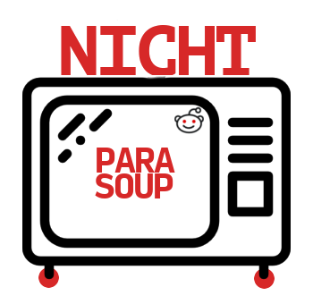
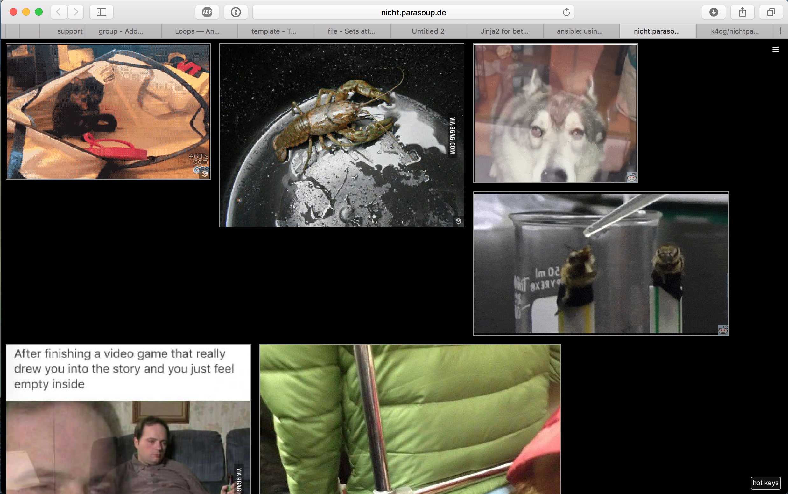
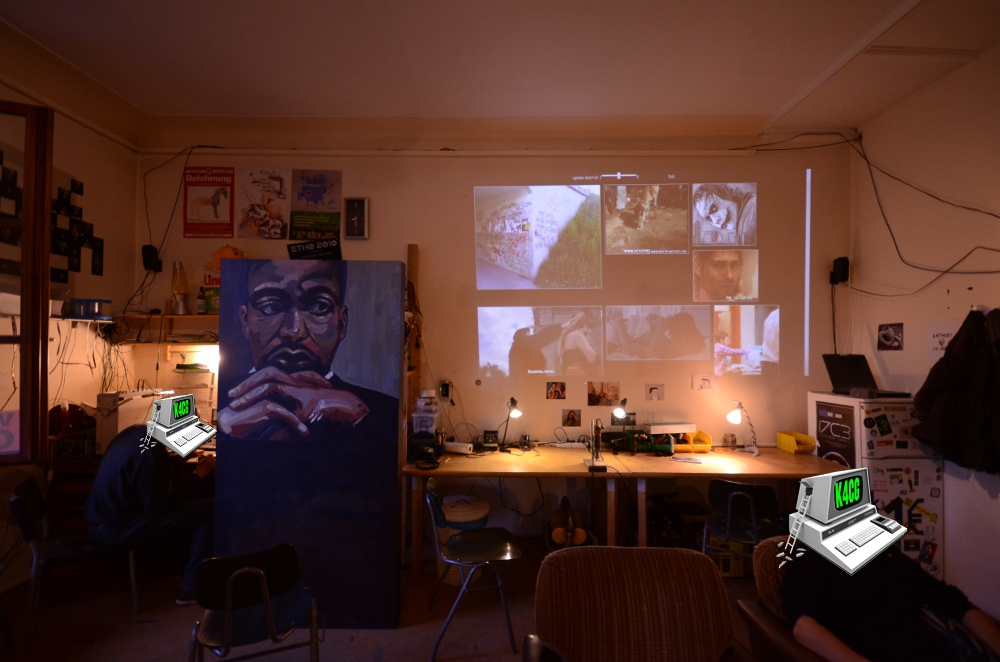

# nichtparasoup

nichtparasoup is a hackspaces entertainment system.
It randomly displays images/gifs from
[giphy](https://giphy.com),
[soup.io](http://soup.io),
[pr0gramm](https://pr0gramm.com),
[4chan](https://4chan.org),
[9gag](https://9gag.com) and
[reddit](https://reddit.com).



At our hackspace [k4cg](https://k4cg.org) we
use it since 2 years now. It turns out to be a very non-invasive way of
entertaining a crowd of nerds without having the noise and interruptions of
videos or other stuff.

Here is what it looks like in your browser


and even better, on a beamer in your local hackspace!


## demo

Visit [nicht.parasoup.de/demo/](http://nicht.parasoup.de/demo/) to try it!

## setup

```sh
git clone https://github.com/k4cg/nichtparasoup
cd nichtparasoup
pip install -r requirements.txt
```

after that you can just run

```sh
./nichtparasoup.py -c configs/sfw.ini
```

## configuration

configuration takes place in `config.ini` - edit the file to your needs or
you may write a derived config `myCustom.ini` and start the server via
`nichtparasoup.py -c myCustom.ini`. if you do so, you may edit some of the
sections. not all is needed since most things are already defined in the
[`config.defaults.ini`](config.defaults.ini) which may be overwritten by your
custom config file.

**Important: a configuration file is required**

Some example config files are included in the [`configs`](configs) directory.

### general

specify port, bind address and user agent that nichtparasoup uses for
visiting the sites on crawler

```ini
[General]
Port: 5000
IP: 0.0.0.0
Useragent: Mozilla/5.0 (Macintosh; Intel Mac OS X 10_10) AppleWebKit/600.1.25 (KHTML, like Gecko) Version/8.0 Safari/600.1.25
Urlpath: /sfw
```

the `Urlpath` parameter specifies where the application should listen on.
For example the value `/sfw` would configure the webserver listening on
`http://localhost:5000/sfw/`

### cache

* `Images` indicates how many images will be loaded per crawler on each crawler
   run
* `Images_min_limit` configures at how many images the crawler starts again
   collecting new images from the sites.

```ini
[Cache]
Images: 30
Images_min_limit: 15
```

### logging

logging section is mostly self-explaining

```ini
[Logging]
Log_name: nichtparasoup
File: nichtparasoup.log
Verbosity: debug
```

### sites

Configuration of your source work like this.

```ini
[Sites]
; set to false or remove a Crawler, to disable it
SoupIO: everyone
Pr0gramm: new,top
Reddit: nsfw,gifs,pics,nsfw_gifs,aww,aww_gifs,reactiongifs,wtf,FoodPorn,cats,ImGoingToHellForThis,EarthPorn,facepalm,fffffffuuuuuuuuuuuu,oddlysatisfying
NineGag: geeky,wtf,girl,hot,trending
Instagram: cats,animals,pornhub,nerdy_gaming_art,nature,wtf
Fourchan: b,sci
Giphy: feels, alcohol, fail, troll, diy, robot, stars, physics
```

For example Reddit: wtf,gifs will end up in `https://reddit.com/r/wtf` and
`https://reddit.com/r/gifs` end up being in the crawler. For 9gag you can
add any site that hits the scheme `https://9gag.com/<topic>`.

Crawlers can be weighted against each other with optional factors ranging
from 0.1 to 10.0:

```ini
[Sites]
SoupIO: everyone*2.5
Pr0gramm: top*5.0,new*0.5
```

The default factor is 1. In the configuration above the images from
SoupIO-everyone should be around the half of Pr0gramm-top as well as around
five times as much as Pr0gramm-new.

## contribution

/!\ attention:
keep the code compatible for py2 and py3.

### server side & crawlers

you find a crawler missing or not working? feel free to fill the gaps.

writing a crawler will take less than half an hour. just grab one of the
existing implementations, copy it, modify it, test it.

don't forget to write a test config to [`tests/configs`](tests/configs) and use
this for testing your work easily.

if you like, you may also contribute a logo for the frontend. just follow
the instructions from the
[`templates_raw/root/css/sourceIcons.css`](templates_raw/root/css/sourceIcons.css)
file and compile the frontend afterwards.

### frontend

/!\ see the [template_raw](template_raw) dir and the read the README there.

basically, check out the repo and initialize the template bundler

As the template bundler is a separate repo you have to execute the
following commands if you want to use it (to create your own templates).

```sh
git submodule update --init --recursive
cd templates_raw/_bundler
pip install -r requirements.txt
```

## internals

### commands

You can interact with nichtparasoup in an "api" way very easy.
For example `curl localhost:5000/<command>`. You can insert every command here
listed below.

* `/get` - gets a JSON with an image uri and other information
* `/imagelist` - prints out every image url in the cache
* `/blacklist` - prints out every image url that is blacklisted
   (e.g. "already seen")
* `/status` - prints number of images in cache and blacklist and size in
   memory of these two lists in a readable way.
   pass parameter `t=json` to get a JSON response.
* `/flush` - will delete everything in cache but not in blacklist
* `/reset` - deletes everything in cache and blacklist

### behavior

when you start nichtparasoup

* system will fill up cache by startup
  (30 image urls cached per defined crawler by default)
* system starts up the webserver
* point your browser to the configured `localhost:5000/`
  or whatever is configured in the config
* start page will request single images randomly by `/get` and show it
* when system's cache is empty, it will be refilled by the crawler
  automatically
* you will (hopefully) get new results.

keep in mind: every time you restart nichtparasoup, the cache forgets about its
previous shown images. So is not persistent.

### cache_fill in threads

once you start up nichtparasoup the crawler will initially fill the cache up
`Images`. this happens in a separate thread in the background. when your
configured `Images_min_limit` get hit, the crawler starts choosing
a new random image provider (see at the top) and refills your cache. the
crawler thread wakes up every `1.337` seconds and checks the status of the
current image map.

## license

MIT - see the [`LICENSE`](LICENSE) file for details.

## credits

* see the [`AUTHORS`](AUTHORS) file for a list of essential contributors
* parts of the logo are taken
   from [Smashicons](https://www.flaticon.com/authors/smashicons)
   on [www.flaticon.com](https://www.flaticon.com/)
   are licensed [CC BY 3.0](https://creativecommons.org/licenses/by/3.0/)
